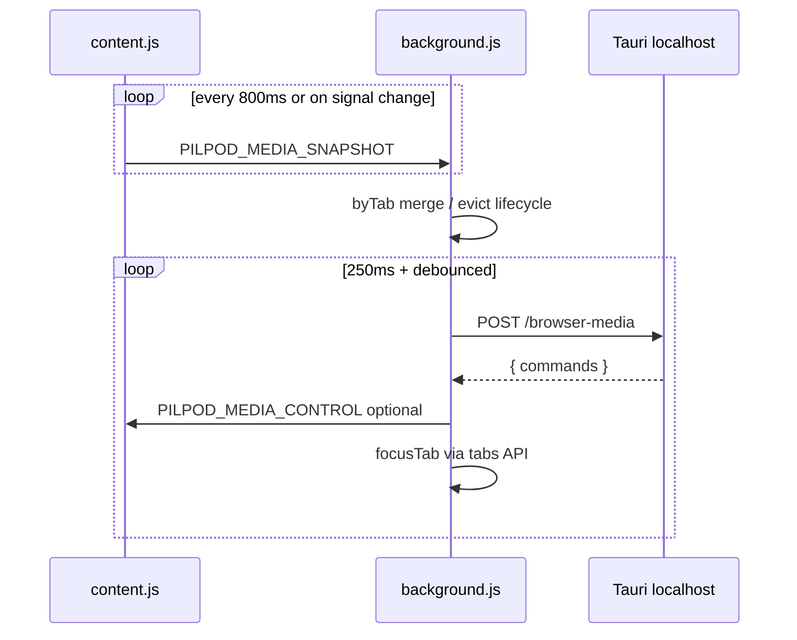

# React project — structure and file roles

> ⚠️ This document describes the old byTab-only model and old tick loop.
> It is outdated as of the media detection refactor. See `plans/MEDIA_DETECTION_REFACTOR_WORKPLAN.md` and `docs/MEDIA_DETECTION.md`.

Here is a concise map of the **React (Vite) UI** in this repo. The app is a **Tauri 2** desktop shell: the frontend is **React 19**, **TypeScript**, **Vite 7**, and **plain CSS** (design tokens in `index.css`, component styles in co-located `.css` files).

---

## React-related folder tree (by directory)

### Repository root (tooling + HTML shell)

| File | Role |
|------|------|
| `package.json` | NPM scripts (`dev`, `build`, `tauri`) and deps: React, Tauri API, Vite. |
| `package-lock.json` | Locked dependency versions. |
| `tsconfig.json` | TypeScript settings for the app source. |
| `tsconfig.node.json` | TypeScript settings for Node-side configs (e.g. Vite). |
| `vite.config.ts` | Vite + React plugin; dev server on port **1420** for Tauri; ignores watching `src-tauri`. |
| `index.html` | HTML shell: `#root` mount, **`pilpod-theme`** flash script to avoid light/dark FOUC, favicon, title **PilPod**. |
| `.vscode/extensions.json` | Suggested VS Code extensions for the workspace. |

---

### `src/` — application entry and globals

| File | Role |
|------|------|
| `main.tsx` | Boots React: applies stored appearance, mounts `<App />` into `#root`, `StrictMode`. |
| `App.tsx` | Top-level component; renders only `MediaDashboard`. |
| `index.css` | Global design tokens (`:root` / `html.dark`), shell transitions, scrollbar hiding; imported by `main.tsx`. |
| `vite-env.d.ts` | Vite/client TypeScript reference declarations. |

---

### `src/theme/`

| File | Role |
|------|------|
| `appearance.ts` | **Light/dark** theme: storage key, read/apply/persist to `documentElement` and `localStorage`. |

---

### `src/types/`

| File | Role |
|------|------|
| `media.ts` | **Shared DTO types** aligned with the Rust/Tauri backend: GSMTC snapshot, Windows `MediaSessionDto`, browser tab media, timelines, controls, audio session info, bridge port constant. |

---

### `src/features/media-dashboard/` — main feature module

| File | Role |
|------|------|
| `MediaDashboard.tsx` | **Main screen**: composes header, footer, source tabs, browser/Windows panels, error banner; **widget mode** delegates to `WidgetView`; wires `useMediaDashboard` + `useAppearance`. Imports `MediaDashboard.css`. |
| `MediaDashboard.css` | Layout shell classes for full-window dashboard (inner column, scroll main). |
| `model.ts` | Small domain model: `MediaMainTab` (`"browser"` \| `"windows"`). |
| `index.ts` | Barrel export: `MediaDashboard`, `MediaMainTab`. |
| `constants.ts` | Event name (`gsmtc://update`), always-on-top storage key, widget transition/drag constants. |

#### `src/features/media-dashboard/components/`

| File | Role |
|------|------|
| `DashboardHeader.tsx` | Top bar: logo, counts, always-on-top, minimize, close; co-located `DashboardHeader.css`. |
| `DashboardFooter.tsx` | Bottom bar: attribution, appearance toggle, refresh, widget toggle; co-located `DashboardFooter.css`. |
| `SourceTabBar.tsx` | Switches main view between **Browser** and **Windows** sources; co-located `SourceTabBar.css`. |
| `BrowserSessionsPanel.tsx` | Lists browser media sessions (grouped UI); co-located `BrowserSessionsPanel.css`. |
| `BrowserTabRow.tsx` | Single browser tab row; co-located `BrowserTabRow.css`. |
| `BrowserMediaThumb.tsx` | Artwork/thumbnail for a browser tab; co-located `BrowserMediaThumb.css`. |
| `WindowsSessionsPanel.tsx` | Lists Windows GSMTC sessions; co-located `WindowsSessionsPanel.css`. |
| `WindowsSessionRow.tsx` | Single Windows session row; co-located `WindowsSessionRow.css`. |
| `AppVolumeSlider.tsx` | Per-app/session volume UI; co-located `AppVolumeSlider.css`. |
| `WidgetMediaPanel.tsx` | Expanded widget panel UI; co-located `WidgetMediaPanel.css`. |
| `WidgetView.tsx` | **Compact “widget” window** UI and gestures; co-located `WidgetView.css`. |
| `icons.tsx` | Shared SVG/icon components + spinner; imports `icons.css`. |

#### `src/features/media-dashboard/hooks/`

| File | Role |
|------|------|
| `useMediaDashboard.ts` | **Core state**: Tauri `invoke` + `listen` for GSMTC updates, snapshot/error, main tab, pending keys, always-on-top, **widget vs full window**, browser toggle/focus, refresh, session toggles, mixer volume, derived lists (`sessions`, `browserTabs`, groups). |
| `useAppearance.ts` | React state for appearance; syncs with `theme/appearance.ts` on change. |

#### `src/features/media-dashboard/lib/`

| File | Role |
|------|------|
| `windowsMedia.ts` | Helpers for Windows sessions: thumbnail data-URL, row keys, “channel” label, playing detection. |
| `browserMedia.ts` | Helpers for browser tabs: playing detection, **group by `browserId`**, group labels, row keys. |
| `format.ts` | Time formatting from ticks/seconds; session duration labels. |

---

## Adjacent (not React, but same repo)

| Location | Role |
|----------|------|
| `src-tauri/` | Rust **Tauri backend** (windowing, GSMTC, audio, commands) — not part of the React tree. |
| `extensions/pilpod-companion/` | **Browser extension** (`manifest.json`, `background.js`, `content.js`) bridging tab media to the desktop app — plain JS, not React. |

---

## Mental model

- **One React feature surface**: almost all UI lives under `src/features/media-dashboard/`, driven by `useMediaDashboard` talking to Tauri and by types in `src/types/media.ts`.
- **Thin shell**: `App.tsx` only mounts the dashboard; `main.tsx` handles theme before paint.

If you want the same treatment for **`src-tauri`** (Rust modules and each file’s role), say so and we can map that tree the same way.

---

# React `src` — logic per file

Below is how **each file under `src` behaves** — what it stores, when it runs, and how data/control flows.

---

## `src/main.tsx`

1. Imports global CSS.
2. Reads theme from `localStorage` via `readStoredAppearance()` and applies it **before** React mounts (`applyAppearance`), so the first paint matches the user’s light/dark choice (aligned with the inline script in `index.html`).
3. Creates the React root on `#root` and renders `<App />` inside `StrictMode`.

---

## `src/App.tsx`

Pure composition: returns `<MediaDashboard />` with no routing or extra providers. The UI is entirely the media dashboard.

---

## `src/index.css`

- Defines **design tokens** on `:root` and **`html.dark`** (semantic zinc/emerald palette), consumed by component stylesheets via `var(--pilpod-…)`.
- Makes `html`, `body`, `#root` full height, **transparent** background, **no overflow** — fits a frameless/transparent Tauri window.
- **`.pilpod-shell-dim`** and `.is-dimming` / `.is-entering` / `.is-entered`: CSS transitions for shrinking/fading when minimizing to widget and for the short “enter” animation when restoring from widget (driven by classes from `MediaDashboard`).
- **`@keyframes pilpod-spin`** for loading spinners (`icons.css`).
- Hides scrollbars globally while keeping scroll behavior (wheel, etc.).

---

## `src/vite-env.d.ts`

Triple-slash reference so TypeScript knows **Vite client** types (e.g. `import.meta` patterns, static asset imports).

---

## `src/theme/appearance.ts`

- **`THEME_STORAGE_KEY`**: `"pilpod-theme"`.
- **`readStoredAppearance`**: reads `localStorage`; only `"light"` / `"dark"` are honored; anything else or errors → **`"dark"`**.
- **`applyAppearance`**: sets `<html>` `.dark` class and `color-scheme` for native form controls / UA styling.
- **`persistAppearance`**: writes mode to `localStorage`, ignores failures (private mode, etc.).

---

## `src/types/media.ts`

**Type-only contract** with the Tauri backend (and extension bridge semantics):

- **`BROWSER_BRIDGE_PORT`**: documented port constant for the browser bridge.
- **`GsmtcSnapshot`**: versioned payload: Windows **GSMTC** sessions, optional **browser tabs** and **`browserAudio`** map (per browser profile `browserId` → volume/mute info).
- **`BrowserTabMediaDto` / `MediaSessionDto`**: fields for titles, playback, timelines, controls, thumbnails, optional **`audio`** on Windows rows.
- **`AudioSessionInfoDto`**: **`instanceId`** for mixer commands, **`volume`**, **`muted`**.
- **`TimelineDto` / `ControlsDto`**: Windows timeline in ticks and transport capability flags.

No runtime logic — shapes expected from `invoke` / events.

---

## `src/features/media-dashboard/index.ts`

Barrel: re-exports `MediaDashboard` and type `MediaMainTab` so consumers import from `./features/media-dashboard`.

---

## `src/features/media-dashboard/model.ts`

**`MediaMainTab`**: union `"browser" | "windows"` — which source tab is active in the dashboard.

---

## `src/features/media-dashboard/constants.ts`

- **`GSMTC_UPDATE_EVENT`**: Tauri event name (`"gsmtc://update"`) for live snapshot pushes.
- **`ALWAYS_ON_TOP_STORAGE_KEY`**: persists always-on-top as `"1"` / `"0"`.
- **`WIDGET_TRANSITION_MS`**: delay before calling backend to enter widget mode (matches CSS ~220ms dim).
- **`WIDGET_DRAG_THRESHOLD_PX`**: minimum pointer movement before a gesture counts as a **drag** (window move) vs **tap** (restore).

---

## `src/features/media-dashboard/hooks/useAppearance.ts`

1. Initializes React state using **`readStoredAppearance`** (lazy init function, not a new read every render).
2. On every **`appearance`** change: **`applyAppearance`** + **`persistAppearance`** so DOM and storage stay in sync.
3. **`toggle`** flips dark ↔ light.

---

## `src/features/media-dashboard/hooks/useMediaDashboard.ts`

Central orchestration between **UI** and **Tauri**:

**State**

- **`snapshot`**: latest `GsmtcSnapshot` from refresh or events.
- **`error`**: string from failed `invoke`s.
- **`mainTab`**: browser vs windows.
- **`pendingKeys`**: `Set` of row keys (`b:…` / `w:…`) while an async control is in flight → shows spinner, avoids double-clicks.
- **`alwaysOnTop`**: from `localStorage` default `"0"`/`"1"`.
- **`isWidget`**: full UI vs mini widget.
- **`dimmingToWidget`**, **`fullEnterActive`**, **`fullEnterVisible`**: drive CSS classes on the shell for transitions.
- **`windowTransitionLock`**: ref to block overlapping widget/full transitions.

**Refresh**

- **`refresh`**: `invoke("gsmtc_snapshot"`-like — actually **`gsmtc_refresh`**) with retry loop: on failure waits 120ms, retries up to 12 times, then sets **`error`**.

**Effects**

- When `alwaysOnTop` changes and **not** in widget mode: **`getCurrentWindow().setAlwaysOnTop(alwaysOnTop)`** (errors ignored in browser dev).
- On mount: subscribe to **`GSMTC_UPDATE_EVENT`** → **`setSnapshot(payload)`**, clear error; also calls **`refresh()`**. Cleanup unsubscribes.

**Browser controls**

- **`toggleBrowser`**: key = `browserRowKey(t)`; **`invoke("browser_media_control", { playPause, browserId, tabId })`**; pending around the call.
- **`focusBrowserTab`**: **Turns off always-on-top** (window API + state + `localStorage`) so the browser can come forward; **50ms delay**; then **`invoke("browser_media_control", { focusTab, …hints })`**. Documents why in comments (PilPod on top would block focus).

**Window / widget**

- **`toggleAlwaysOnTop`**: toggles state + persists `"1"`/`"0"`.
- **`minimizeToWidgetMode`**: if not locked, sets **`dimmingToWidget`** true, after **`WIDGET_TRANSITION_MS`** calls **`invoke("toggle_widget_mode", { isMini: true })`**, then **`isWidget` true**; clears dimming/lock in `finally`.
- **`restoreFromWidget`**: **`toggle_widget_mode` false**, **`isWidget` false**, reapplies always-on-top, then **double `requestAnimationFrame`** + timeout to set **`fullEnter*`** for enter animation; clears lock after **`WIDGET_TRANSITION_MS + 40`**.
- **`closeApp`**: **`getCurrentWindow().close()`**.

**Widget pointer gestures**

- **`onWidgetSurfacePointerDown`**: primary button only; stores start x/y, `dragged: false`, **captures pointer**.
- **`onWidgetSurfacePointerMove`**: if movement² ≥ threshold² → **`dragged = true`**, **`startDragging()`**, release capture, clear ref (so drag doesn’t trigger restore).
- **`onPointerUp` / Cancel**: release capture; if **not** dragged and not cancel and primary button → **`restoreFromWidget()`**.

**Windows / mixer**

- **`toggleWinSession`**: `winRowKey`, **`invoke("gsmtc_toggle_play_pause", { sessionIndex })`**, pending wrapper.
- **`setMixerVolume`**: **`invoke("mixer_set_volume", { instanceId, volume })`**.

**Derived**

- **`sessions`**, **`browserTabs`**, **`browserAudio`** from snapshot with `?? []` / `{}`.
- **`browserProfileGroups`**: **`useMemo`** of **`groupBrowserTabsByProfile(browserTabs)`**.

Returns one object used by `MediaDashboard` (including **`widgetGestures`**).

---

## `src/features/media-dashboard/MediaDashboard.tsx`

1. **`useAppearance`** + **`useMediaDashboard`**.
2. If **`isWidget`**: only **`WidgetView`** with restore callback and gesture handlers.
3. Else: outer div gets **dim/enter** classes from hook; inner column:
   - **`DashboardHeader`** (counts, theme, always-on-top, refresh, widget minimize, close).
   - **`SourceTabBar`** (browser vs windows + counts).
   - **`main`**: optional **error** banner; **`BrowserSessionsPanel`** or **`WindowsSessionsPanel`** by **`mainTab`**, passing pending keys, sessions/groups, **`browserAudio`**, play/pause/focus, **`setMixerVolume`**.

---

## `src/features/media-dashboard/components/DashboardHeader.tsx`

- **`data-tauri-drag-region="deep"`** so the user can drag the window from the chrome.
- Left: title + live counts `{browserTabCount} br · {sessionCount} win`.
- Buttons: always-on-top (pressed styling), theme (sun/moon by mode), refresh, minimize-to-widget, close — all call parent callbacks.

---

## `src/features/media-dashboard/components/SourceTabBar.tsx`

Accessible **tablist**: two **tabs** — Browsers (count), Windows (count). `aria-selected`, `id` / `aria-controls` pair with panels. Same drag region as header.

---

## `src/features/media-dashboard/components/BrowserSessionsPanel.tsx`

- **`role="tabpanel"`** wired to browser tab id.
- Empty state: copy about extension + Chromium.
- Else: for each **`[browserId, tabs]`** group — card with header:
  - **`browserGroupLabel`**
  - If **`browserAudio[browserId]`**: **`AppVolumeSlider`** (per-profile volume).
- List of **`BrowserTabRow`** with **`browserRowKey`**, **`pendingKeys.has(rk)`** as `busy`.

---

## `src/features/media-dashboard/components/BrowserTabRow.tsx`

- **Playing** styling from **`isBrowserPlaying`**.
- Subtitle: **artist** (`channelBrowser`) and optional **position/duration** via **`formatMediaSeconds`** when `duration` is known.
- Thumb: **`BrowserMediaThumb`**; overlay button calls **`onFocusTab`** (stop propagation).
- **Play/Pause** button: disabled when **`busy`**, shows **`Spinner`** when busy, else play/pause icon from **`playing`**.

---

## `src/features/media-dashboard/components/BrowserMediaThumb.tsx`

**Fallback chain** for small square:

1. State **`mode`**: `"art" | "fav" | "letter"`.
2. **`useEffect`**: if `artworkUrl` → `"art"`; else if **`faviconFromUrl(url)`** → `"fav"`; else `"letter"`.
3. Letter mode: first letter of title (uppercase).
4. Image mode: **`img`** with **`onError`**: from art, fall back to favicon if possible, else letter.

---

## `src/features/media-dashboard/components/WindowsSessionsPanel.tsx`

- Tab panel for Windows.
- Empty: “No Windows media sessions.”
- Else: list of **`WindowsSessionRow`**; **`disabled`** for play button when busy **or** **`!session.controls.playPauseToggleEnabled`**.

---

## `src/features/media-dashboard/components/WindowsSessionRow.tsx`

- Thumbnail: **`thumbSrc`** (data URL from base64) or placeholder “—”.
- Title + line with **`channelSession`** (artist else subtitle) and **`sessionDurationLabel`** (end ticks only if > 0).
- If **`session.audio`**: **`AppVolumeSlider`** with **`instanceId`**.
- Play/pause: respects **`disabled`** and **`busy`**, same visual pattern as browser row.

---

## `src/features/media-dashboard/components/AppVolumeSlider.tsx`

- Shows **percent** or **"M"** when muted (from DTO); tooltip includes mute + percent.
- **Controlled** `<input type="range">` **`0..1`**, `step 0.02`, **`value={audio.volume}`** — UI updates when snapshot refreshes after backend applies volume.
- **`onChange`**: clamps to `[0,1]`, calls **`onVolumeChange(audio.instanceId, v)`**.

---

## `src/features/media-dashboard/components/WidgetView.tsx`

- Full-area **transparent** host; **`touch-none`** to behave predictably with drag.
- **Close** button (top-right): visible on group hover, **`stopPropagation`** on pointer down so it doesn’t start a drag; **`onRestore`**.
- **Draggable surface**: **`role="button"`**, Enter/Space restores, pointer handlers from **`gestures`** (implements drag vs tap in the hook).
- Center: static **music glyph** (decorative, `pointer-events-none`).

---

## `src/features/media-dashboard/components/icons.tsx`

Small **presentational** SVGs (play, pause, open-in-tab, pin-on-top, widget minimize/close, music glyph, moon/sun, refresh) and a **CSS spinning border** **`Spinner`**. Mostly `aria-hidden` where decorative.

---

## `src/features/media-dashboard/lib/browserMedia.ts`

- **`channelBrowser`**: trimmed artist or null.
- **`isBrowserPlaying`**: `playbackState === "playing"`.
- **`groupBrowserTabsByProfile`**: first-seen order of **`browserId`**, each maps to tab array.
- **`browserGroupLabel`**: **`browserName`** from first tab, else shortened **`browserId`** + ellipsis marker.
- **`browserRowKey`**: stable **`b:${browserId}:${tabId}`**.
- **`faviconFromUrl`**: for `http/https`, returns Google s2 favicon URL for **hostname**; else null.

---

## `src/features/media-dashboard/lib/windowsMedia.ts`

- **`thumbSrc`**: data URL from optional mime + base64.
- **`winRowKey`**: **`w:${sessionIndex}`** (matches backend ordering).
- **`channelSession`**: artist, else subtitle, else null.
- **`isSessionPlaying`**: lowercase **`playbackStatus === "playing"`**.

---

## `src/features/media-dashboard/lib/format.ts`

- **`formatTicks`**: Windows **100ns** ticks → `m:ss` (ticks / 10⁷ = seconds).
- **`formatMediaSeconds`**: integer seconds → `m:ss`.
- **`sessionDurationLabel`**: null if **`endTicks <= 0`**, else **`formatTicks(endTicks)`** (total duration, not current position).

---

### End-to-end data flow (short)

Tauri pushes **`GsmtcSnapshot`** on **`gsmtc://update`** and answers **`gsmtc_refresh`**. The hook keeps **`snapshot`**; panels render **browser groups + rows** or **Windows rows**. User actions call **`browser_media_control`**, **`gsmtc_toggle_play_pause`**, **`mixer_set_volume`**, or **window/widget** commands; **`pendingKeys`** and **`error`** coordinate UX. Theme and always-on-top persist in **`localStorage`** and sync to the DOM / Tauri window where applicable.

---

# Tauri Rust — structure and file roles

Here is a structured overview of the **Tauri / Rust** side under `src-tauri`: layout, files, and what each one does.

---

## High level

- **Crate**: `pilpod` (binary) + `pilpod_lib` (library) — Tauri 2, **Windows-focused** (GSMTC, WASAPI, localhost bridge). Non-Windows builds compile **stub** commands that return errors.
- **Entry**: `main.rs` → `pilpod_lib::run()` from `lib.rs`.
- **Config**: `Cargo.toml`, `tauri.conf.json`, `capabilities/default.json`, `build.rs`.

---

## Folder tree (source and config)

```
src-tauri/
├── Cargo.toml
├── Cargo.lock
├── build.rs
├── tauri.conf.json
├── capabilities/
│   └── default.json
├── .gitignore
└── src/
    ├── main.rs
    ├── lib.rs
    ├── app/
    │   ├── mod.rs
    │   ├── handlers.rs
    │   └── setup.rs
    ├── browser_tabs.rs
    ├── browser_bridge/
    │   ├── mod.rs
    │   ├── http.rs
    │   └── command.rs
    ├── gsmtc/
    │   ├── mod.rs
    │   ├── dto.rs
    │   ├── state.rs          (Windows)
    │   ├── commands.rs       (Windows)
    │   ├── mapping.rs        (Windows)
    │   ├── thumbnail.rs      (Windows)
    │   └── audio_attach.rs   (Windows)
    ├── audio_mixer/
    │   └── mod.rs            (Windows-only in practice via gsmtc)
    ├── window_widget.rs      (Windows)
    ├── browser_focus_win.rs  (Windows)
    └── platform/
        ├── mod.rs            (non-Windows only)
        └── stub_commands.rs  (non-Windows only)
```

`tauri.conf.json` references `icons/` for bundling; that folder was **not** present in the workspace glob (it may exist on your machine or be generated — worth verifying before release builds).

---

## Root `src-tauri/` files

| File | Role |
|------|------|
| **`Cargo.toml`** | Package manifest: `pilpod` + `pilpod_lib`; **Windows** pulls in `windows`, `base64`, `tiny_http`; `tauri-build` as build-dep. |
| **`Cargo.lock`** | Pinned dependency versions for reproducible builds. |
| **`build.rs`** | Runs **`tauri_build::build()`** so Tauri codegen (icons, capabilities, etc.) runs at compile time. |
| **`tauri.conf.json`** | Tauri 2 app config: product name, identifier, `beforeDevCommand` / `devUrl` / frontend `dist`, **main window** (350×600, undecorated, transparent), bundle targets and icon paths, CSP. |
| **`capabilities/default.json`** | Declares **`main`** window capability: default core + **set-always-on-top**, **close**, **start-dragging**, **internal-toggle-maximize**. |
| **`.gitignore`** | Rust/Tauri ignore rules for this subproject. |

---

## `src/main.rs`

Sets **`windows_subsystem = "windows"`** in release so no extra console flashes on Windows. **`main`** only calls **`pilpod_lib::run()`**.

---

## `src/lib.rs`

- **`mod app`**, **`browser_tabs`**, **`gsmtc`** always compiled.
- **Windows-only**: `browser_bridge`, `browser_focus_win`, `audio_mixer`, `window_widget`.
- **Non-Windows**: `platform` (stubs).
- **Re-exports**: `pub use app::run`.

---

## `src/app/`

| File | Role |
|------|------|
| **`mod.rs`** | **`run()`**: builds **`tauri::Builder`**. On Windows: **`Manage(RestoreBounds)`**, **`setup(setup::init)`**, then **`handlers::with_invoke_handler`**, then **`run(generate_context!())`**. |
| **`handlers.rs`** | Registers **Tauri `invoke` commands**: **Windows** → real `gsmtc::*`, `browser_bridge::browser_media_control`, `mixer_set_volume`, `toggle_widget_mode`. **Non-Windows** → same names but **`platform::stub_commands`** (always fail). |
| **`setup.rs`** | **`init` hook**: creates shared **`BrowserTabsMap`** and **`BrowserCommandsQueue`**, manages command queue on app state, shared **`gsmtc_slot`** (`Mutex<Option<Arc<GsmtcState>>>`), **`spawn`s browser HTTP bridge**, then **spawns a thread** to **`GsmtcState::create`** (avoids blocking STA / WinRT `.get()` on the UI thread) and **`manage`s** the state when ready. |

---

## `src/browser_tabs.rs`

- **`BrowserSlot`**: last heartbeat, connection string, tab list for one **browser profile** (`browserId`).
- **`BrowserTabsMap`**: `Arc<Mutex<HashMap<String, BrowserSlot>>>`.
- **`BrowserCommandsQueue`**: queued **`BrowserMediaCommand`**s per `browserId` for the extension’s next poll.
- **`enqueue_browser_command`**: pushes **playPause / next / previous** (and focus is handled separately in `command.rs`).
- **`flatten_tabs` / `flatten_tabs_at`**: builds the flat **`Vec<BrowserTabMediaDto>`** for the UI; **hides** slots that stayed **`disconnected`** with no newer POST for **>1s** (grace behavior).
- **`#[cfg(test)]`**: unit tests for flatten/grace logic.

---

## `src/browser_bridge/`

| File | Role |
|------|------|
| **`mod.rs`** | Module docs; **`BROWSER_BRIDGE_PORT`** (17399), **`BROWSER_MEDIA_PATH`** (`/browser-media`); re-exports **`http::spawn`**; exposes **`command`** submodule. |
 **`http.rs`** | **`tiny_http`** server on **`127.0.0.1`** only: rejects non-loopback; handles **OPTIONS** (CORS); **POST** parses **`BrowserMediaPost`** JSON; updates **`BrowserTabsMap`** for that **`browser_id`** (fallback key `unknown-{port}`); **tags** tabs with profile metadata; if GSMTC is up, **`emit_fast_to_ui`**; **drains** pending commands for that browser into JSON response **`{ ok, commands }`**. |
| **`command.rs`** | **`browser_media_control`**: normalizes action strings, **`enqueue_browser_command`**; for **`focusTab`**, calls **`browser_focus_win::spawn_raise_browser_window`** with title/hint. |

---

## `src/gsmtc/`

| File | Role |
|------|------|
| **`mod.rs`** | Declares submodules; **`dto`** always; **Windows-only**: `mapping`, `audio_attach`, `state`, `thumbnail`, **`pub mod commands`**; **`pub use state::GsmtcState`** on Windows. |
| **`dto.rs`** | **Serde** DTOs aligned with the frontend: **`GsmtcSnapshot`** (version constant), **`BrowserTabMediaDto`**, **`MediaSessionDto`**, timeline/controls, **`AudioSessionInfoDto`**, etc. **`camelCase`** JSON. |
| **`state.rs`** (Windows) | **`GsmtcState`**: holds WinRT **`GlobalSystemMediaTransportControlsSessionManager`**, per-session **Playback/Media/Timeline** event hooks, **`browser_tabs`** map. **`create`**: requests manager, subscribes **`SessionsChanged`**, **`resubscribe`** refreshes hooks; **`emit_fast_to_ui`** builds snapshot on a worker thread and **`emit("gsmtc://update", snap)`**. **`snapshot()`** for **`gsmtc_refresh`**: **`build_snapshot(..., true)`** (thumbnails), merge tabs, **`enrich_snapshot_with_audio`**, **dedup**. **`session_at_index`** for transport commands. **`Drop`** removes tokens and **`SessionsChanged`**. |
| **`commands.rs`** (Windows) | Tauri commands as **`async fn`** + **`spawn_blocking`** so WinRT **`.get()`** never blocks the main thread: **`gsmtc_refresh`**, **`gsmtc_toggle_play_pause`**, **`gsmtc_skip_next`**, **`gsmtc_skip_previous`**, **`mixer_set_volume`** (WASAPI set + **`emit_fast_to_ui`**). |
| **`mapping.rs`** (Windows) | **`build_snapshot`**: walks GSMTC sessions → **`MediaSessionDto`** (AUMID, playback, timeline, controls, optional **thumbnail** via **`read_thumbnail_b64`**). **`apply_extension_gsmtc_dedup`**: if extension sent **`browser_tabs`**, strips **Chromium-family** system sessions so the same media is not listed twice. |
| **`thumbnail.rs`** (Windows) | Reads WinRT **`IRandomAccessStreamWithContentType`** into bytes, **base64** + optional **MIME**, size cap (**512 KiB**). |
| **`audio_attach.rs`** (Windows) | **`enrich_snapshot_with_audio`**: enumerates **WASAPI** sessions (`audio_mixer::enumerate_sessions`), **heuristically matches** mixer rows to **GSMTC AUMIDs** and **browser profiles** (path/tokens), fills **`audio`** on **`MediaSessionDto`** and **`browserAudio`** map for the UI. |

---

## `src/audio_mixer/mod.rs` (Windows)

- **`MixerSessionRow`**: instance id, PID, display name, volume, mute, optional exe path.
- **`enumerate_sessions`**: COM MTA init, default render device, session enumerator, skips system-sounds session, collects **simple volume** + **image path** from process.
- **`set_session_volume_by_instance_id`**: finds session by **instance id**, **`SetMasterVolume`**.

---

## `src/window_widget.rs` (Windows)

- **`RestoreBounds`**: `Mutex<Option<(LogicalSize, LogicalPosition)>>` stored in Tauri state.
- **`toggle_widget_mode`**: **`is_mini` true** → save logical bounds, **non-resizable**, **always on top**, move/size to **small square** in monitor work-area corner; **false** → restore **resizable** and prior (or default phone) size/position with logic to place restored window **above** the widget slot when coming from mini mode.

---

## `src/browser_focus_win.rs` (Windows)

- **`spawn_raise_browser_window`**: background thread + delay; **enumerates top-level windows**, scores captions vs **tab title** and **browser hint** (Chrome/Edge/Brave/etc.), picks best **HWND**, **`ShowWindow(SW_RESTORE)`**, **`SetForegroundWindow`** with **AttachThreadInput** tricks where needed — helps **focus tab** requests when the extension alone cannot satisfy foreground rules.

---

## `src/platform/` (non-Windows only)

| File | Role |
|------|------|
| **`mod.rs`** | Exposes **`stub_commands`** when **`not(windows)`**. |
| **`stub_commands.rs`** | Same command names as real handlers; **return `Err("PilPod requires Windows")`** so the app can build on other OSes without implementing WinRT/WASAPI. |

---

## How the pieces connect (short)

1. **Setup** starts the **HTTP bridge** and **GSMTC** on a dedicated thread; state is **`manage`d** when ready.  
2. **Extension** POSTs tab media → **`browser_tabs`** → optional **`gsmtc://update`**.  
3. **GSMTC** events or **`mixer_set_volume`** rebuild snapshots and **emit** to the React UI.  
4. **UI `invoke`** either drives **WinRT transport**, **command queue** (browser), **WASAPI volume**, or **widget geometry**.

If you want the same level of “line-by-line logic” as we did for `src/` React, say which module to deep-dive first (**`gsmtc/state`**, **`audio_attach`**, or **`browser_bridge/http`**) — those are the densest.

---

# Tauri Rust — logic per file

Here is how **each file under `src-tauri`** behaves: control flow, threading, and integration points.

---

## `build.rs`

Runs **`tauri_build::build()`** at compile time so Tauri can generate the embedded app context, process resources, and wire the project to `tauri.conf.json`.

---

## `Cargo.toml` / `Cargo.lock`

**`Cargo.toml`** defines the **`pilpod`** binary and **`pilpod_lib`** library (`staticlib`, `cdylib`, `rlib` for mobile/embed targets). Core deps: **Tauri 2**, **serde**. **Windows-only** deps: **`windows`** (WinRT Media.Control, Win32 audio/UI/COM), **`base64`**, **`tiny_http`**. **`Cargo.lock`** pins exact versions.

---

## `tauri.conf.json`

Product identity, dev (`npm run dev` → `http://localhost:1420`) and build (`../dist`) hooks. **Main webview** label **`main`**: initial phone size, **undecorated**, **transparent**, no shadow. **Bundle** section lists icon paths (files may live outside the tree you globbed). **`csp: null`** disables a strict CSP in dev/simple setups.

---

## `capabilities/default.json`

Scopes **permissions** for the **`main`** window: default **core** plus explicit allow for **always-on-top**, **close**, **start-dragging**, **internal-toggle-maximize** — matching what the React side calls.

---

## `src/main.rs`

Release builds use **`windows_subsystem = "windows"`** to avoid an extra console on Windows. **`main`** only delegates to **`pilpod_lib::run()`**.

---

## `src/lib.rs`

Declares modules with **`cfg(windows)`** vs **`cfg(not(windows))`**:

- Always: **`app`**, **`browser_tabs`**, **`gsmtc`** (dto always; Windows-only pieces behind cfgs inside `gsmtc`).
- Windows: **`browser_bridge`**, **`browser_focus_win`**, **`audio_mixer`**, **`window_widget`**.
- Non-Windows: **`platform`** (stub commands).

**`pub use app::run`** is the library entry used by **`main`**.

---

## `src/app/mod.rs` — **`run()`**

1. **`tauri::Builder::default()`**.
2. **Windows**: **`manage(RestoreBounds::default())`** for widget restore geometry; **`setup(setup::init)`** for bridge + GSMTC startup.
3. **`handlers::with_invoke_handler(builder)`** registers all **`invoke`** commands.
4. **`run(generate_context!())`** — panics with a message string if startup fails.

---

## `src/app/handlers.rs`

**`with_invoke_handler`** attaches the **`generate_handler!`** list:

- **Windows**: real implementations — **`gsmtc_refresh`**, **toggle/skip** commands, **`browser_media_control`**, **`mixer_set_volume`**, **`toggle_widget_mode`**.
- **Non-Windows**: same **names** but **`stub_commands`** so the crate still compiles; every call returns **`Err("PilPod requires Windows")`**.

---

## `src/app/setup.rs` — **`init`**

Runs once when the Tauri app starts:

1. Clones **`AppHandle`**.
2. Builds **`BrowserTabsMap`** (empty `HashMap` in a `Mutex`) and **`BrowserCommandsQueue`** (empty per-browser command map).
3. **`manage`**s the command queue so **`browser_media_control`** can use **`State`**.
4. Creates **`gsmtc_slot`**: `Arc<Mutex<Option<Arc<GsmtcState>>>>` so the HTTP bridge can emit updates **before** `GsmtcState` exists (optional `None`).
5. **`browser_bridge::spawn(...)`** — background **HTTP** thread on loopback.
6. Spawns **`gsmtc-init`** thread: calls **`GsmtcState::create`**. On success: stores state in **`gsmtc_slot`**, **`manage`**s **`Arc<GsmtcState>`** on the app. On failure: logs to stderr.

Rationale in comments: WinRT **`.get()`** blocks; must not run on the STA UI thread.

---

## `src/browser_tabs.rs`

**`BrowserSlot`**: **`last_seen: Instant`**, **`connection_state`**, **`tabs: Vec<BrowserTabMediaDto>`** — one slot per **`browser_id`**.

**`BrowserTabsMap`**: shared map **`browser_id → BrowserSlot`**.

**`BrowserCommandsQueue`**: **`browser_id → Vec<BrowserMediaCommand>`** — desktop queues actions; extension picks them up in the HTTP response.

**`enqueue_browser_command`**: push **`{ tab_id, action }`** (normalized elsewhere) onto the right queue entry.

**`flatten_tabs` / `flatten_tabs_at(now)`**: flattens all slots’ **`tabs`** into one **`Vec`**, but **drops** slots where **`connection_state`** is **`disconnected`** (case-insensitive) **and** **`last_seen`** is older than **1 second** — stale disconnected browsers vanish from the UI.

**Tests** (`#[cfg(test)]`): cover grace timing and multi-browser flatten behavior.

---

## `src/browser_bridge/mod.rs`

Documents the bridge: **127.0.0.1**, companion extension, per-profile slots, disconnect grace. Exports **`BROWSER_BRIDGE_PORT`** (17399), **`BROWSER_MEDIA_PATH`**, submodules **`command`** and **`http`**, **`pub use http::spawn`**.

---

## `src/browser_bridge/http.rs` — **`spawn`**

1. Binds **`tiny_http`** **`Server::http("127.0.0.1:PORT")`**; on failure logs and returns (no panic).
2. Spawns **`browser-bridge`** thread; loop **`incoming_requests()`**:
   - **403** if remote address is not **loopback**.
   - Only path **`/browser-media`**; else **404** with CORS headers.
   - **OPTIONS** → **204** + CORS.
   - **POST** only; read body as string; **400** on read/JSON errors.
   - Parse **`BrowserMediaPost`**: `browser_id`, `browser_name`, `connection_state`, `tabs`.
   - If **`browser_id`** empty, synthesize **`unknown-{remote_port}`** so multiple bare clients don’t all key the same slot.
   - Clone metadata onto each **`BrowserTabMediaDto`** (profile id/name/connection).
   - **`HashMap::insert`** replaces that browser’s **`BrowserSlot`** with **`last_seen = now`** and new **`tabs`** (extension owns tab list deltas).
   - If **`gsmtc_slot`** holds **`GsmtcState`**, call **`emit_fast_to_ui`** so UI updates immediately.
   - **Drain** **`command_queue`** for this **`browser_key`** (take vector, default empty).
   - Respond **200** JSON **`{ ok: true, commands: [...] }`** with CORS.

CORS headers allow extension origins to POST from browser.

---

## `src/browser_bridge/command.rs` — **`browser_media_control`**

1. Require non-empty **`browser_id`**.
2. Normalize **`action`** (case/aliases) to **`playPause`**, **`next`**, **`previous`**, **`focusTab`**; unknown → **Err**.
3. **`enqueue_browser_command`** for **`playPause`**, **`next`**, **`previous`**, **`focusTab`** (all go through queue for extension except focus has extra Win32 step).
4. If **`focusTab`**: **`browser_focus_win::spawn_raise_browser_window(title, hint)`** to raise the browser frame after the extension adjusts the tab.

---

## `src/gsmtc/mod.rs`

- **`pub mod dto`** always.
- Windows-only: **`mapping`**, **`audio_attach`**, **`state`**, **`thumbnail`**, **`pub mod commands`**, **`pub use state::GsmtcState`**.

---

## `src/gsmtc/dto.rs`

**Serde** types with **`camelCase`** for the frontend:

- **`SNAPSHOT_VERSION`** constant.
- **`BrowserTabMediaDto`**, **`MediaSessionDto`**, **`TimelineDto`**, **`ControlsDto`**, **`AudioSessionInfoDto`**, **`GsmtcSnapshot`** (sessions + optional **`browser_tabs`** + **`browser_audio`** `HashMap`).

**`audio`** on **`MediaSessionInfoDto`** uses **`skip_serializing_if`** when absent.

---

## `src/gsmtc/thumbnail.rs`

**`read_thumbnail_b64(stream)`**: reads **`IRandomAccessStreamWithContentType`** — checks **size** (skip if 0 or **> 512 KiB**), **`DataReader`** loads bytes, **base64** encodes, reads **ContentType** as optional MIME (empty MIME → base64 only, `mime` None).

---

## `src/gsmtc/mapping.rs`

**Chromium AUMID markers**: substrings like `chrome`, `msedge`, `brave`, etc.

**`apply_extension_gsmtc_dedup`**: if **`browser_tabs`** is non-empty, **remove** GSMTC sessions whose **`source_app_user_model_id`** looks like a **Chromium-family** source — avoids duplicate “browser” rows when the extension already lists tabs.

**`playback_status_str` / `timeline_from_win` / `controls_from_win`**: map WinRT enums/structs to plain strings/DTOs; timeline converts **`LastUpdatedTime`** to Unix ms via WinRT epoch offset.

**`map_session`**: for one **`GlobalSystemMediaTransportControlsSession`** and index:

- **AUMID**, **playback** (status + **controls** + optional **playback_type** debug string).
- **Timeline** or zeros.
- **TryGetMediaPropertiesAsync** → **.get()** for title/artist/album/subtitle; if **`include_thumbnails`**, open thumbnail stream and **`read_thumbnail_b64`**.
- **`audio: None`** here — filled later by **`audio_attach`**.

**`build_snapshot`**: **`GetSessions()`**, **`GetAt(i)`** for each, **`map_session`**, returns **`GsmtcSnapshot`** with **empty** `browser_tabs` / default `browser_audio` (filled elsewhere).

---

## `src/gsmtc/state.rs`

**`EVT`**: `"gsmtc://update"`.

**`SessionHooks`**: session + three registration **tokens** for event detachment.

**`GsmtcInner`**: **`sessions_changed_token`**, **`session_hooks`**.

**`GsmtcState`**: **`manager`**, **`inner`**, **`browser_tabs`** map (shared with bridge).

**`emit_fast_to_ui(app, state)`**: spawns **`gsmtc-emit`** thread (so WinRT callback threads don’t block on snapshot work):

- **`build_snapshot(manager, false)`** — **no thumbnails** on hot path for speed.
- Lock **`browser_tabs`**, **`flatten_tabs`** → **`snap.browser_tabs`**.
- **`enrich_snapshot_with_audio`**, **`apply_extension_gsmtc_dedup`**, **`app.emit(EVT, snap)`**.

**`clear_session_hooks`**: **`RemovePlaybackInfoChanged`** etc. for each session.

**`GsmtcState::create`**:

1. **`RequestAsync()?.get()`** for session manager.
2. **`Arc::new`** state with empty hooks.
3. **`SessionsChanged`** handler: calls **`resubscribe`** on self (refresh session list and per-session listeners).
4. Initial **`resubscribe`**, then **`emit_fast_to_ui`**.

**`resubscribe`**:

1. Take old hooks, **clear** them.
2. **`GetSessions()`**, for each index **register** **`PlaybackInfoChanged`**, **`MediaPropertiesChanged`**, **`TimelinePropertiesChanged`** — each calls **`emit_fast_to_ui`**.
3. Store new hooks; **`emit_fast_to_ui`** again.

**`snapshot()`** (for **`gsmtc_refresh`**): **`build_snapshot(..., true)`** (thumbnails), merge **`flatten_tabs`** from mutex, **`enrich_snapshot_with_audio`**, **dedup**, **Ok**.

**`session_at_index`**: bounds-check **`GetAt(session_index)`** for transport commands.

**`Drop`**: clear hooks, **`RemoveSessionsChanged`**.

---

## `src/gsmtc/commands.rs`

**`run_blocking`**: **`async_runtime::spawn_blocking`** wrapper.

All commands are **`async fn`** so Tauri runs them off the main thread; **WinRT `.get()`** runs inside **`spawn_blocking`**:

- **`gsmtc_refresh`**: **`state.snapshot()`**.
- **`gsmtc_toggle_play_pause`**: **`TryTogglePlayPauseAsync()?.get()`**.
- **`gsmtc_skip_next` `/ gsmtc_skip_previous`**: analogous **Skip** APIs.
- **`mixer_set_volume`**: **`set_session_volume_by_instance_id`**, then **`emit_fast_to_ui`** so sliders and data stay in sync.

Errors stringify WinRT **`message()`** or join errors.

---

## `src/gsmtc/audio_attach.rs`

Goal: attach **WASAPI** volume (**`instance_id`**, level, mute) to **Windows sessions** and to **per-browser profile** rows.

**Token / path helpers**: normalize paths, split AUMIDs into tokens, filter **generic** tokens and hex blobs, build token sets from **exe path** / **display name**.

**GSMTC → mixer matching** (`match_gsmtc_audio`), tried in order:

1. **`match_gsmtc_by_exe_path`**: AUMID left segment looks like **existing `.exe`** path → compare normalized **`image_path`**.
2. **`match_gsmtc_by_exe_stem_in_aumid`**: **exe stem** substring in **lower AUMID** (Store apps).
3. **`match_gsmtc_by_package_token_in_process_path`**: package family tokens from AUMID appear in **`image_path`** (e.g. under **WindowsApps**).
4. **`match_gsmtc_by_aumid_token_overlap`**: longest **token-in-AUMID** hit from **exe path + display name** tokens; require **unique** winning PID.
5. **`match_gsmtc_by_media_metadata`**: WASAPI **display name** overlaps **title/artist/subtitle/album**; again unique PID.

**`pick_mixer_row_for_pid`**: if multiple rows share PID, prefer non-empty **display_name**.

**Browser profiles** (`match_browser_profiles`):

- Group **`browser_tabs`** by **`browser_id`**.
- Collect normalized **titles** for matching.
- **`chromium_sessions_for_profile`**: filter mixer rows to **chromium exes**; optionally filter by **`browser_name`** hint (Edge vs Brave vs Chrome, etc.).
- Pick one mixer row: **exact** display name vs tab title; else **substring** match; else if **only one** chromium session and there are titles, use it.
- **`browser_audio`**: **`browser_id → AudioSessionInfoDto`**.

**`enrich_snapshot_with_audio`**: **`enumerate_sessions()`**; on failure log and return; else set **`session.audio`** for each **`MediaSessionDto`**, set **`snap.browser_audio`**.

---

## `src/audio_mixer/mod.rs`

**`ensure_com_multithreaded`**: **`CoInitializeEx(MULTITHREADED)`**; tolerates **already initialized** / **CHANGED_MODE**.

**`enumerate_sessions`**: default **render** endpoint → **`IAudioSessionManager2`** → enumerate; skip **system sounds**; for each session: **PID**, **instance id string**, **display name**, **ISimpleAudioVolume** for level/mute, **`QueryFullProcessImageName`** for **exe path**.

**`set_session_volume_by_instance_id`**: re-enumerate, find row by **`instance_id`**, **`SetMasterVolume`**.

---

## `src/window_widget.rs`

**Constants**: default **phone** logical size **350×600**, widget **50×50** px, corner margin, gap above widget.

**`RestoreBounds`**: optional saved **logical size + position** before mini mode.

**`main_window`**: **`get_webview_window("main")`**.

**`toggle_widget_mode(app, state, is_mini)`**:

- **`is_mini == true`**: read **scale factor**, **outer_size/position**, convert to **logical**, store in **`RestoreBounds`**; **non-resizable**, **always_on_top**; read **monitor work_area**; position **bottom-right** widget square; **set_size** to widget px.
- **`is_mini == false`**: **set_size** from saved logical size or default phone size. If current size was **widget** sized: compute position so **restored window** is **centered horizontally above** the widget anchor (clamped to work area). Else if saved position: **set_position**; else **center**. Finally **always_on_top(false)** (normal stacking).

---

## `src/browser_focus_win.rs`

**`browser_frame_class_ok`**: **`Chrome_WidgetWin_1`** or **`MozillaWindowClass`**.

**`browser_hint_matches_caption`**: maps hints like **edge**, **brave**, **firefox** to caption substrings.

**`score_match`**: scores caption vs **tab title** (prefix contains > contains) and **browser hint** penalties/bonuses; **-1** = no match.

**`enum_windows_proc`**: skip invisible, non-root, child, owned windows; require browser class; read caption; **`score_match`**; keep **best HWND**.

**`bring_window_to_foreground`**: **restore**, then **`SetForegroundWindow`**, using **AttachThreadInput** if needed vs current foreground.

**`spawn_raise_browser_window`**: background thread, **8 attempts** with **160ms** then **100ms** sleeps (wait for caption after tab switch); **EnumWindows**; if **valid score**, bring to front; else retry.

---

## `src/platform/mod.rs` / `src/platform/stub_commands.rs`

**Non-Windows**: **`stub_commands`** module only.

Each **`#[tauri::command]`** matches the real API surface but returns **`Err("PilPod requires Windows")`** so **`cargo build`** on Linux/macOS still succeeds without Windows APIs.

---

## End-to-end logic summary

| Path | What happens |
|------|----------------|
| App start | **`setup`**: bridge thread + GSMTC init thread; state **`manage`d** when ready. |
| Extension POST | Updates **`BrowserTabsMap`**; may **emit** partial GSMTC snapshot (no thumbs on emit path). |
| GSMTC changes | **Resubscribe** / per-session events → **`emit_fast_to_ui`** (snapshot + audio + dedup). |
| UI refresh | **`gsmtc_refresh`** builds full snapshot **with thumbnails**. |
| Play/pause (Windows) | WinRT **async .get()** on worker via **`spawn_blocking`**. |
| Browser control | Queue for extension; **focus** additionally **raises** HWND heuristically. |
| Volume | WASAPI **set** + **emit**; matching ties GSMTC/browser rows to **mixer** sessions. |
| Widget | Save bounds → mini square / restore phone window with placement rules. |

If you want one module traced **call-by-call** (for example **`emit_fast_to_ui` ↔ `enrich_snapshot_with_audio`** or the **`match_gsmtc_audio`** decision order), say which one and we can walk it as a sequence diagram in text.

---

# PilPod Companion extension — logic

Here is how the **PilPod Companion** extension works, file by file, and how it lines up with the desktop app.

---

## `manifest.json` (MV3)

- **Manifest 3** extension named **PilPod Companion**.
- **Permissions**:  
  - **`storage`** — persist `pilpodBrowserId`.  
  - **`tabs`** — read/update/highlight tabs, react to lifecycle.  
  - **`scripting`** — available if you inject scripts later (not heavily used in the snippets you have; often paired with dynamic injection).
- **`host_permissions`**: only **`http://127.0.0.1:17399/*`** — the localhost bridge (matches Rust **`BROWSER_BRIDGE_PORT`** and path).
- **Service worker**: **`background.js`** (no persistent background page).
- **Content script**: **`content.js`** on **http/https**, **`document_idle`**, **top frame only** (`all_frames: false`).

---

## `background.js` (service worker) — central hub

### Role

1. Stable **browser identity** per profile.  
2. In-memory **map of tabs** that currently report real media.  
3. **POST** snapshots to the desktop on a timer and when data changes.  
4. Apply **commands** returned in the POST JSON (play/pause/next/prev/focus).  
5. **Evict** stale tabs on close/navigate/replace/window-close.  
6. Track **connection health** (`connected` / `disconnected`) for the UI.

### Config

| Constant | Effect |
|----------|--------|
| **`PUSH_URL`** | `POST http://127.0.0.1:17399/browser-media` |
| **`PUSH_INTERVAL_MS` (250)** | Heartbeat + command polling |
| **`DEBOUNCE_MS` (60)** | Coalesce rapid updates before `push()` |
| **`FAIL_THRESHOLD` (3)** | Failed POSTs before **`disconnected`** |

### State

- **`byTab`**: `Map<tabId, TabRow>` — only tabs that have (or recently had) media signal from the content script.  
- **`browserId`**: loaded from **`chrome.storage.local`** key **`pilpodBrowserId`**, or generated with **`crypto.randomUUID()`** and saved.  
- **`browserName`**: **`detectBrowserName()`** once at load.  
- **`failCount`**, **`connectionState`**: desktop reachability.  
- **`debounceTimer`**: single debounced push.

### Browser detection (`detectBrowserName`)

Uses **`navigator.userAgentData.brands`** when present (Brave, Opera, Vivaldi, Edge), else **UA string** substrings (`opr/`, `edg/`, `arc/`, `firefox`, etc.). Returns a display string (**Chrome**, **Unknown**, …). Arc is called out as often masquerading as Chrome in UA.

### Init (`chrome.storage.local.get`)

Ensures **`browserId`** exists before pushes; **`push()`** no-ops if **`browserId`** is still empty (race on first run).

### Incoming messages (`chrome.runtime.onMessage`)

Only **`type === "PILPOD_MEDIA_SNAPSHOT"`** from a **`sender.tab`**.

- **`!payload.hasSignal`**: remove that **`tabId`** from **`byTab`** if present, **`schedulePush()`** — tab explicitly cleared its media.  
- Else build a **row** (tabId, browserId, url, title, artist, album, playbackState, artworkUrl, duration, currentTime).  
- Compare to previous row: push only if **playbackState**, **title**, or **currentTime** changed (or new tab). **`byTab.set`**, then **`schedulePush()`** if changed.

### Push pipeline

**`schedulePush()`**: if no timer, start **`setTimeout(DEBOUNCE_MS)`** → **`push()`** (coalesces bursts).

**`push()`**:

1. Serialize **`{ browserId, browserName, connectionState, tabs }`** (`tabs` = `Array.from(byTab.values())`).  
2. **`fetch(PUSH_URL, { POST, AbortSignal.timeout(800) })`**.  
3. Non-OK → **`_recordFailure()`**, return.  
4. OK → reset **`failCount`**, set **`connectionState = "connected"`** if it was bad.  
5. Parse JSON; read **`data.commands`**.  
6. For each command: skip bad **`tabId`/action**; skip if tab **not in `byTab`** (not a media tab we track).  
   - **`focusTab`**: **`focusTab(tid)`** in background only (no content script).  
   - Else: **`chrome.tabs.sendMessage(tid, { type: PILPOD_MEDIA_CONTROL, action })`**; on failure (**tab gone / no CS**), **delete from `byTab`**.

**`_recordFailure()`**: increment **`failCount`**; after **3** failures set **`connectionState = "disconnected"`**.

### Focus (`focusTab`)

1. **`chrome.tabs.get`** — on error, evict tab + **`schedulePush()`**.  
2. **`chrome.windows.update(..., { focused: true, state: "normal" })`** — un-minimize / raise window.  
3. **`chrome.tabs.highlight({ windowId, tabs: [index] })`** — preferred path; fallback **`chrome.tabs.update(tabId, { active: true })`**.  
4. Second **`windows.update(focused: true)`** to work around OS ignoring first focus.  
5. Failures can evict + push.

### Timers

- **`setInterval(push, 250)`** — steady heartbeat + command drain.  
- **`void push()`** once on SW startup.

### Tab lifecycle listeners

| Event | Logic |
|--------|--------|
| **`tabs.onRemoved`** | If in **`byTab`**, delete + **`schedulePush()`**. |
| **`tabs.onUpdated`** | If **`status === "loading"`** and tab was tracked, delete + push (new page will re-report). |
| **`tabs.onReplaced`** | Move row from **removed** to **added** tab id (avoid losing row during swap); **`schedulePush()`**. |
| **`windows.onRemoved`** | **`tabs.query`** all; remove any **`byTab`** keys not in live set; push if changed. |

---

## `content.js` — page context: detect media, tick, obey controls

### Role (top-level frame only)

1. Decide if the page has **real** media (`hasSignal`).  
2. Every **`TICK_MS` (800)** send a snapshot to background (with a **spam guard**).  
3. Handle **`PILPOD_MEDIA_CONTROL`** from background: play/pause/next/prev.

### Media helpers

- **`allMediaElements()`**: all **`<video>`** + **`<audio>`**.  
- **`loadedMediaElements()`**: **`readyState >= 1`** (has metadata).  
- **`activeMediaElement()`**: prefer **playing** and **readyState > 2**; else **paused** with content.  
- **`playbackState()`**: **`none`** / **`playing`** / **`paused`** from DOM state.  
- **`pickArtworkUrl()`**: best **MediaSession.metadata.artwork** by size hint, else **`video.poster`**.

### `snapshot()`

- Title/artist/album from **MediaSession** (title fallback **`document.title`**).  
- **`hasSignal`**:  
  - **loaded** media elements exist, **or**  
  - **MediaSession** has a **non-empty** `metadata.title` (together with title check — avoids empty video-only placeholders without real metadata path).  
- Includes **artworkUrl**, **url**, **duration/currentTime** from **`activeMediaElement()`** or 0.

### Controls

- **`doPlayPause`**: toggle **`activeMediaElement`**, else **`mediaSession.callActionHandler('play'|'pause')`**, else synthetic **`MediaPlayPause`** key events.  
- **`doNext` / `doPrevious`**: **MediaSession** `nexttrack` / `previoustrack`, then synthetic media keys.

### Message listener

**`PILPOD_MEDIA_CONTROL`**: dispatch **`playPause`**, **`next`**, **`previous`**. **`sendResponse({ ok: true })`**, returns **`true`** (async channel).

### Tick loop

- **`lastHasSignal`**: only send if **`hasSignal`** **or** we need to **clear** a prior signal (transition to no media without spamming idle pages).  
- **`setInterval(tick, 800)`** + immediate **`tick()`**.  
- **`sendMessage`** failures → **`clearInterval`** (e.g. extension reload).

---

## `RUST_INTEGRATION_NOTES.md`

Not executed — **briefing** for the Tauri side: payload shape (`browserName`, `connectionState`, duration/time), **`focusTab`**, timing (~60 ms debounce, 250 ms heartbeat), and a migration checklist. Logic above is the **source of truth** in JS; the doc may lag code slightly (Rust still uses disconnect grace in **`flatten_tabs`** — intentional on the desktop side).

---

## How the pieces fit together



**Summary**: **content.js** decides *which tabs are really playing something* and streams coarse-updated rows; **background.js** owns *one profile id*, *aggregation*, *HTTP to PilPod*, *command execution*, and *tab hygiene*; **manifest** wires permissions and the loopback host.

---

