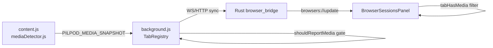

# Media Detection

Spec for how PilPod decides a browser tab is "media" and shows it in the dashboard.

## Three-gate rule

A tab is reported as media only when **all three gates pass**:

| Gate | Check | Fail reason |
|------|-------|-------------|
| URL | Page URL matches the allowlist | `url-not-allowlisted` |
| Playing | `playbackState === "playing"` | `not-playing` |
| Active | Tab is selected **or** producing audio | `tab-not-active` |

Implementation:

- **URL allowlist:** [`pilpod-companion/src/shared/mediaUrlRules.js`](../pilpod-companion/src/shared/mediaUrlRules.js)
- **Combined gate:** [`pilpod-companion/src/shared/mediaGate.js`](../pilpod-companion/src/shared/mediaGate.js)
- **UI filter:** [`src/features/media-dashboard/lib/browserMedia.ts`](../src/features/media-dashboard/lib/browserMedia.ts) — `tabHasMedia()`

## Data flow



1. **Content script** — Early URL exit on non-allowlisted pages. Strict `hasSignal` (playing element or playing MediaSession only).
2. **TabRegistry** — `applyMediaSnapshot()` runs `shouldReportMedia()` using tab URL, active, audible, and snapshot playback state.
3. **Rust bridge** — Forwards tab posts; `TabMedia` only present when extension attached media.
4. **React UI** — `tabHasMedia()` shows playing tabs in the media section.

## URL allowlist

Authoritative source: `mediaUrlRules.js`.

**Groups (first match wins):**

1. **Direct extensions** — `.mp4`, `.webm`, `.mp3`, `.aac`, `.flac`, `.wav`, `.ogg`, `.m3u8`, `.mpd` on any host
2. **Host + path rules** — YouTube `/watch`, Spotify `/track`, Netflix `/watch`, etc.
3. **Broad hosts (path-prefix)** — SoundCloud `/{user}/{slug}`, Kick `/{username}`, Rumble `/v…` or `/embed/`
4. **TikTok glob** — `tiktok.com/@*/video/`

## Resolved decisions

| # | Question | Resolution |
|---|----------|------------|
| 0 | Background audio: does `audible` override inactive tab? | **Yes** — `active \|\| audible` |
| 1 | Broad hosts (SoundCloud, Kick, Rumble) | **Path-prefix only** (stricter than whole-host) |
| 2 | Content script injection | **Universal inject + early return** in script |

## Audio attach

[`src-tauri/src/gsmtc/audio_attach.rs`](../src-tauri/src/gsmtc/audio_attach.rs) matches WASAPI sessions to browser profiles using media tab titles. With the audible override, background-audible music (e.g. Spotify) still carries `media.title` and volume isolation continues to work.

## Tests

```bash
cd pilpod-companion && npm run test   # mediaUrlRules, mediaGate, registry
cd .. && npm run test                 # browserMedia
cd src-tauri && cargo test
```

## Manual QA matrix

See Phase 9 in [`plans/MEDIA_DETECTION_REFACTOR_WORKPLAN.md`](../plans/MEDIA_DETECTION_REFACTOR_WORKPLAN.md) for the full 16-scenario checklist (YouTube home, paused watch, background audible, direct `.mp4`, navigation clear, etc.).
