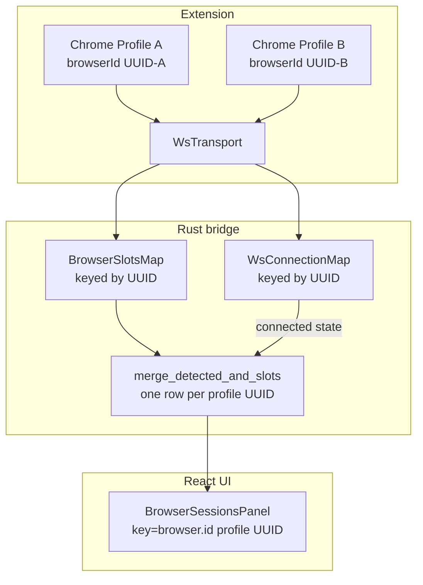

# PilPod Bridge — Phase 2 Remaining Tasks

> **Status:** Implemented (Tasks 1–3) · Documented (Tasks 4–5)  
> **Reference:** [`PILPOD_BRIDGE_REFINEMENT_PLAN.md`](./PILPOD_BRIDGE_REFINEMENT_PLAN.md)

This document is the implementation playbook for the four actionable Phase 2 gaps identified against the refinement plan, plus a deferred appendix for SharedWorker research.

**In scope (implemented):** Tasks 1–3  
**Document only:** Task 4 (Windows-only by design)  
**Deferred appendix:** Task 5 (SharedWorker — needs study, not in this sprint)

---

## Architecture: before vs after



**Target achieved:** one UI row per extension profile UUID; connection state driven by WS map when WS is active; HTTP fallback keeps heartbeat + backoff.

---

## Task 1 — Multi-profile rows (P2-2) ✅

### Problem

`merge_detected_and_slots` mapped every slot to an OS id via `browser_name_to_id()` and **replaced** tabs when two profiles shared the same browser (e.g. two Chrome profiles). The UI grouped by `browser.id` (OS id).

### Solution

Emit **one `DetectedBrowser` row per `BrowserSlot`** (profile UUID), not per OS browser executable.

### Changes

| File | Change |
|------|--------|
| `src-tauri/src/gsmtc/dto.rs` | `id` = profile UUID; added `osBrowserId`, optional `profileLabel` |
| `src-tauri/src/browser_detector.rs` | Rewrote merge: Pass A (OS placeholders), Pass B (one row per slot) |
| `src-tauri/src/browser_commands.rs` | `refresh_browser_connection` matches slot by profile UUID |
| `src/types/media.ts` | Added `osBrowserId`, `profileLabel` |
| `src/features/media-dashboard/components/BrowserSessionsPanel.tsx` | Uses `profileLabel ?? displayName`; `browser.id` for commands/audio |
| `src/features/media-dashboard/lib/browserMedia.ts` | Search tags use profile UUID + disambiguated label |

### Verification

- Install companion in two Chrome profiles → two separate rows, both tab lists visible
- Play/pause/focus commands hit correct profile (`browser_media_control` uses profile UUID)
- Refresh on one profile does not stale the other

---

## Task 2 — WS lifecycle connection state (P2-2) ✅

### Problem

`extension_connected` was `last_seen < 3s` only. On WS disconnect, the UI could show "connected" for up to 3 s.

### Solution

Treat **WS socket presence** as the primary connected signal; heartbeat freshness as fallback for HTTP-only clients.

### Changes

| File | Change |
|------|--------|
| `src-tauri/src/browser_bridge/connections.rs` | Added `ws_connected_ids()` |
| `src-tauri/src/browser_bridge/ws.rs` | On disconnect: insert into `reconnecting`, stale `last_seen`; on connect: `clear_reconnecting` |
| `src-tauri/src/browser_detector.rs` | Merge uses `ws_connected` set for `extension_connected` / `extension_reconnecting` |
| `src-tauri/src/browser_bridge/handler.rs` | `BridgeContext` holds `ws_connections`; threaded through all emit call sites |

Connection logic:

```rust
extension_connected = ws_connected.contains(&slot.browser_id)
    || now.duration_since(slot.last_seen) < cutoff;
extension_reconnecting = reconnecting.contains(&slot.browser_id)
    && !ws_connected.contains(&slot.browser_id);
```

### Verification

- Kill PilPod → extension shows offline/reconnecting within one UI emit, not 3 s lag
- HTTP fallback (block port 17400) → still uses 3 s heartbeat rule
- Wake-from-sleep + WS reconnect clears reconnecting badge

---

## Task 3 — WS reconnect backoff (P2-4) ✅

### Problem

`httpTransport.js` backs off after 4 failures; `wsTransport.js` reconnected every 3 s forever when PilPod was closed.

### Solution

Mirror HTTP backoff in WS transport using `FAIL_THRESHOLD = 4`, `SLEEP_INTERVAL_MS = 5000` from `constants.js`.

### Changes

| File | Change |
|------|--------|
| `pilpod-companion/src/background/transport/wsTransport.js` | Added `#failCount`, `#sleeping`, `#wakeTimer`; backoff after threshold |

### Verification

- Close PilPod → extension WS attempts drop to ~1 per 5 s after initial burst
- Reopen PilPod → reconnects within one wake probe
- HTTP fallback path unchanged

---

## Task 4 — Sleep/wake: Windows-only (P2-4) — document, no new code

### Current state

`system_events.rs` handles `PBT_APMRESUMEAUTOMATIC` on Windows. PilPod core (GSMTC, registry browser scan) is Windows-only per `Cargo.toml`.

### Platform scope

- Sleep/wake invalidation is **implemented and sufficient for the shipping target (Windows)**
- No macOS/Linux implementation in this phase
- If non-Windows dev builds fail on `system_events.rs`, wrap the module in `#[cfg(windows)]` + empty stub (optional hygiene, not user-facing)

---

## Task 5 — SharedWorker (P2-3 title) — deferred appendix

### Future study

The original plan title mentioned SharedWorker; the body only specified event-driven content scripts (already done in `content.js`).

**Not in implementation order** — requires a separate spike:

- MV3 SharedWorker support across Chromium variants
- Cross-tab dedup gains vs complexity
- CSP constraints on extension pages

**Exit criteria for a future ticket:** measure CPU with 20+ idle tabs before/after; decide if SharedWorker beats the current MutationObserver approach.

---

## Suggested implementation order

| Order | Task | Effort | Risk | Status |
|-------|------|--------|------|--------|
| 1 | Multi-profile rows | ~4–6 h | Medium | ✅ Done |
| 2 | WS lifecycle state | ~2–3 h | Low | ✅ Done |
| 3 | WS backoff | ~1 h | Low | ✅ Done |
| 4 | Windows-only docs | ~15 min | None | ✅ Done |
| — | SharedWorker appendix | — | Deferred | 📋 Documented |

---

## Files touched (summary)

| File | Task |
|------|------|
| `docs/PILPOD_BRIDGE_PHASE2_REMAINING.md` | Create — this doc |
| `src-tauri/src/browser_detector.rs` | 1, 2 |
| `src-tauri/src/gsmtc/dto.rs` | 1 |
| `src-tauri/src/browser_commands.rs` | 1, 2 |
| `src-tauri/src/browser_bridge/ws.rs` | 2 |
| `src-tauri/src/browser_bridge/connections.rs` | 2 |
| `src-tauri/src/browser_bridge/handler.rs` | 2 |
| `src-tauri/src/browser_bridge/mod.rs` | 2 |
| `src-tauri/src/browser_bridge/system_events.rs` | 2 |
| `src-tauri/src/app/setup.rs` | 2 |
| `pilpod-companion/src/background/transport/wsTransport.js` | 3 |
| `src/types/media.ts` | 1 |
| `src/features/media-dashboard/components/BrowserSessionsPanel.tsx` | 1 |
| `src/features/media-dashboard/lib/browserMedia.ts` | 1 |

---

## Test plan (manual)

1. **Two Chrome profiles** — both rows visible; commands isolated per profile
2. **Kill / restart PilPod** — reconnecting badge immediate; backoff on extension; recovery on reopen
3. **Laptop sleep/wake (Windows)** — stale media cleared; reconnecting → connected
4. **HTTP fallback** — block port 17400; confirm 3 s heartbeat + HTTP backoff still work
